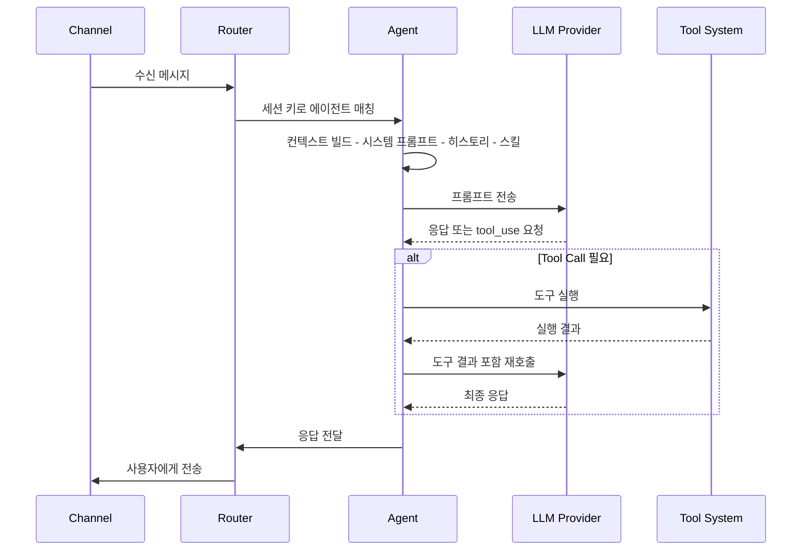

## Agent란 무엇인가

Agent는 사용자의 메시지를 받아 AI 모델을 호출하고, 도구를 사용하여 작업을 수행하는
실행 단위입니다. OpenClaw의 핵심 두뇌에 해당하며, `src/agents/` 디렉토리에
317개의 파일로 구성된 가장 큰 모듈입니다.

에이전트는 단순한 채팅봇이 아닙니다. bash 명령 실행, 웹 검색, 브라우저 제어,
파일 패치, 이미지 생성 등 다양한 도구를 활용할 수 있는 자율적 AI 실행 환경입니다.

## 에이전트 아키텍처

### 디렉토리 구조

```
src/agents/
  auth-profiles/     # OAuth/API 키 로테이션 및 인증 프로파일 관리
  tools/             # 에이전트가 사용할 수 있는 도구 모음
  sandbox/           # 코드 실행 격리 환경 (Docker 기반)
  skills/            # 스킬 프레임워크 (외부 스킬 로딩)
  cli-runner/        # CLI 백엔드 실행기
  bootstrap-files.ts # 시스템 프롬프트 및 초기 파일 로딩
  agent-scope.ts     # 에이전트 범위 및 ID 해석
  compaction.ts      # 대화 기록 압축
  context-window-guard.ts # 컨텍스트 윈도우 관리
```

### 주요 파일

| 파일                 | 역할                                                             |
| -------------------- | ---------------------------------------------------------------- |
| `agent-scope.ts`     | 에이전트 ID 해석, 워크스페이스 디렉토리 결정, 멀티 에이전트 지원 |
| `auth-profiles.ts`   | API 키 로테이션, 쿨다운 관리, 인증 프로파일 순서 결정            |
| `bootstrap-files.ts` | 시스템 프롬프트, `AGENT.md` 등 초기 컨텍스트 파일 로딩           |
| `compaction.ts`      | 긴 대화 기록을 요약하여 컨텍스트 윈도우를 효율적으로 사용        |
| `bash-tools.ts`      | bash 명령 실행 도구 (승인 시스템 포함)                           |
| `cache-trace.ts`     | 캐시 적중률 추적                                                 |

## 에이전트 실행 루프

에이전트가 메시지를 처리하는 전체 과정입니다.



### 단계별 설명

**1단계: 컨텍스트 빌드**

`bootstrap-files.ts`가 시스템 프롬프트를 구성합니다.
워크스페이스의 `AGENT.md`, 설정 파일의 `systemPrompt`, 활성화된 스킬의 프롬프트를 결합합니다.

**2단계: LLM 호출**

구성된 프롬프트와 대화 히스토리를 LLM Provider에 전송합니다.
`auth-profiles.ts`가 사용할 API 키를 결정하며, 실패 시 자동으로 다음 프로파일로 전환합니다.

**3단계: 도구 실행**

LLM이 `tool_use`를 요청하면, 해당 도구를 실행하고 결과를 LLM에 다시 전달합니다.
이 과정은 LLM이 최종 텍스트 응답을 할 때까지 반복됩니다.

**4단계: 응답 전달**

최종 응답을 채널 어댑터를 통해 사용자에게 전송합니다.
스트리밍이 활성화된 채널에서는 토큰 단위로 실시간 전달됩니다.

## 도구 시스템

`src/agents/tools/` 디렉토리에 에이전트가 사용할 수 있는 모든 도구가 정의되어 있습니다.

### 주요 도구 목록

| 도구               | 파일                                           | 설명                                         |
| ------------------ | ---------------------------------------------- | -------------------------------------------- |
| Bash 실행          | `bash-tools.exec.ts`                           | 셸 명령 실행. 승인 시스템으로 위험 명령 차단 |
| 웹 검색            | `web-search.ts`                                | 웹 검색 수행                                 |
| 웹 페이지 가져오기 | `web-fetch.ts`                                 | URL 콘텐츠 가져오기 (Firecrawl 지원)         |
| 브라우저           | `browser-tool.ts`                              | 헤드리스 브라우저 제어                       |
| 이미지 생성        | `image-tool.ts`                                | AI 이미지 생성                               |
| 메모리             | `memory-tool.ts`                               | 장기 메모리 저장/검색                        |
| 메시지 전송        | `message-tool.ts`                              | 다른 채널/대상으로 메시지 전송               |
| 세션 관리          | `sessions-list-tool.ts`                        | 세션 목록 조회 및 관리                       |
| TTS                | `tts-tool.ts`                                  | 텍스트를 음성으로 변환                       |
| Apply Patch        | `apply-patch.ts` (상위)                        | 파일에 패치 적용                             |
| 채널 액션          | `telegram-actions.ts`, `discord-actions.ts` 등 | 채널별 고유 기능 (리액션, 핀, 역할 관리 등)  |

### 도구 승인 시스템

bash 실행과 같은 위험한 도구는 승인 시스템을 거칩니다.
`sandbox/tool-policy.ts`에서 도구별 정책을 정의하고,
Gateway의 `ExecApprovalManager`가 사용자 승인을 관리합니다.

```typescript
// 도구 정책 예시
// "always" - 항상 허용
// "ask" - 사용자 승인 필요
// "never" - 항상 차단
```

## 인증 프로파일

`auth-profiles/` 디렉토리에서 API 키 관리를 담당합니다.

에이전트는 여러 LLM Provider의 API 키를 가질 수 있습니다.
쿨다운, 라운드 로빈, 우선순위 기반 로테이션이 가능합니다.

```
auth-profiles/
  인증 프로파일 저장소
  쿨다운 관리 (rate limit 시 자동 대기)
  마지막 사용 프로파일 추적
  실패 시 자동 전환
```

키가 rate limit에 걸리면 자동으로 쿨다운 타이머를 설정하고
다음 사용 가능한 프로파일로 전환합니다.

## 샌드박스

`sandbox/` 디렉토리에서 코드 실행 격리 환경을 관리합니다.

- `docker.ts` -- Docker 컨테이너 기반 격리 실행
- `config.ts` -- 샌드박스 설정 관리
- `workspace.ts` -- 워크스페이스 마운트 관리
- `tool-policy.ts` -- 도구별 실행 정책

Docker가 설정된 경우, bash 도구의 명령은 격리된 컨테이너 안에서 실행됩니다.
호스트 시스템을 보호하면서도 에이전트에게 유연한 실행 환경을 제공합니다.

## 스킬

`src/agents/skills/`에서 스킬 프레임워크를 관리하고,
`skills/` 루트 디렉토리에 52개의 스킬이 포함되어 있습니다.

스킬은 에이전트에 특화된 능력을 부여하는 모듈입니다.

대표적인 스킬 예시: `github`, `slack`, `discord`, `spotify-player`, `weather`,
`notion`, `obsidian`, `trello`, `coding-agent`, `canvas` 등.

스킬 디렉토리 구조는 다음과 같습니다.

```
skills/
  github/          # GitHub 연동
  slack/           # Slack 고급 기능
  discord/         # Discord 고급 기능
  coding-agent/    # 코딩 에이전트
  weather/         # 날씨 정보
  notion/          # Notion 연동
  ...              # 총 52개 스킬
```

## 핵심 요약

Agent 시스템은 OpenClaw의 지능을 담당합니다.
LLM 호출, 도구 실행, 보안 격리까지 AI 어시스턴트의 실행 엔진 역할을 합니다.
317개 파일에 걸친 방대한 모듈이지만, 핵심은 단순합니다.
메시지를 받고, AI에 물어보고, 도구로 일하고, 답변을 보내는 것입니다.

## 관련 문서

<CardGroup cols={3}>
  <Card title="메모리 시스템" icon="brain" href="/memory">
    임베딩 기반 장기 메모리와 하이브리드 검색을 다룹니다.
  </Card>
  <Card title="세션 시스템" icon="clock-rotate-left" href="/session">
    대화 히스토리 저장, 트랜스크립트, 컴팩션을 다룹니다.
  </Card>
  <Card title="멀티 에이전트" icon="users" href="/multi-agent">
    여러 에이전트 운영과 서브에이전트 시스템을 다룹니다.
  </Card>
</CardGroup>
