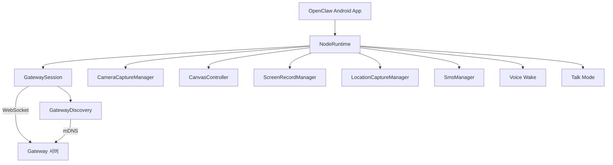

## Android Node 개요

Android Node는 스마트폰의 하드웨어 기능을 에이전트에게 제공하는 컴패니언 앱입니다.
Kotlin과 Jetpack Compose로 구현되어 있으며, `apps/android/`에 위치합니다.

| 항목      | 값              |
| --------- | --------------- |
| 언어      | Kotlin          |
| UI        | Jetpack Compose |
| 최소 SDK  | 31 (Android 12) |
| 타겟 SDK  | 36              |
| Java 버전 | 17              |
| 앱 버전   | 2026.2.10       |

## 아키텍처



## NodeRuntime

`NodeRuntime.kt`(1,271줄)이 Android Node의 핵심 클래스입니다.
모든 하드웨어 기능과 Gateway 통신을 조율합니다.

### 지원 능력

| 능력        | 명령어                                                                                                                        | 설명                            |
| ----------- | ----------------------------------------------------------------------------------------------------------------------------- | ------------------------------- |
| `canvas`    | `canvas.present`, `canvas.hide`, `canvas.navigate`, `canvas.eval`, `canvas.snapshot`, `canvas.a2ui.push`, `canvas.a2ui.reset` | WebView 기반 UI 렌더링          |
| `camera`    | `camera.list`, `camera.snap`, `camera.clip`                                                                                   | 전/후면 카메라 사진 및 동영상   |
| `screen`    | `screen.record`                                                                                                               | MediaProjection 기반 화면 녹화  |
| `location`  | `location.get`                                                                                                                | GPS 위치 (정확도/타임아웃 설정) |
| `sms`       | `sms.send`                                                                                                                    | 문자 메시지 전송                |
| `talk`      | 음성 합성                                                                                                                     | TTS 출력                        |
| `voiceWake` | 음성 깨우기                                                                                                                   | 핫워드 감지                     |

## Gateway 연결

### Discovery (자동 발견)

`GatewayDiscovery.kt`(17KB)에서 mDNS(Bonjour)로 LAN 내 Gateway를 자동 발견합니다.
dnsjava 라이브러리를 사용합니다.

<Steps>
  <Step title="mDNS 브로드캐스트 감지">네트워크에서 OpenClaw Gateway 서비스를 검색합니다.</Step>
  <Step title="Gateway 선택">발견된 Gateway 목록에서 사용자가 선택하거나 자동 연결합니다.</Step>
  <Step title="WebSocket 연결">`GatewaySession.kt`(23KB)이 WebSocket 연결을 수립합니다.</Step>
  <Step title="페어링/인증">
    최초 연결 시 페어링을 요청하고, 이후에는 저장된 토큰으로 자동 인증합니다.
  </Step>
</Steps>

### GatewaySession

`GatewaySession.kt`(23KB)이 WebSocket 통신의 핵심입니다.

| 역할                 | 설명                            |
| -------------------- | ------------------------------- |
| WebSocket 클라이언트 | Gateway와 지속적 연결 유지      |
| RPC 처리             | 요청/응답 매핑 및 타임아웃 관리 |
| 재연결               | 연결 끊김 시 자동 재연결        |
| TLS                  | `GatewayTls.kt`로 인증서 검증   |

### 인증 저장

| 클래스                | 역할                                                 |
| --------------------- | ---------------------------------------------------- |
| `DeviceIdentityStore` | 장치 고유 ID 영속화                                  |
| `DeviceAuthStore`     | 토큰/자격증명 보안 저장 (EncryptedSharedPreferences) |

## 기능별 구현

### 카메라

`CameraCaptureManager.kt`(12KB)에서 CameraX API를 사용합니다.

```
camera.list   --> 사용 가능한 카메라 목록 (전면/후면)
camera.snap   --> 사진 촬영 후 JPEG 반환
camera.clip   --> 동영상 녹화 후 파일 반환
```

`JpegSizeLimiter.kt`가 이미지 크기를 제한하여 네트워크 전송을 최적화합니다.

### 캔버스

`CanvasController.kt`(8.4KB)에서 WebView를 관리합니다.

캔버스는 에이전트가 사용자에게 시각적 UI를 보여주는 기능입니다. A2UI(Agent-to-UI)를 통해 에이전트가 동적으로 UI를 생성하고 제어합니다.

### 화면 녹화

`ScreenRecordManager.kt`(7.1KB)에서 Android MediaProjection API를 사용합니다.
사용자 동의 후 화면을 녹화하며, 오디오 포함 옵션을 지원합니다.

### GPS 위치

`LocationCaptureManager.kt`(4.5KB)에서 Android LocationManager를 사용합니다.
정확도와 타임아웃을 파라미터로 받아 위치를 반환합니다.

### SMS

`SmsManager.kt`(7.5KB)에서 Android TelephonyManager를 사용합니다.
에이전트가 사용자 대신 문자 메시지를 전송할 수 있습니다.

<Warning>SMS 전송은 Android 전용 기능이며, `SEND_SMS` 권한이 필요합니다.</Warning>

## 프로토콜 상수

`OpenClawProtocolConstants.kt`에 모든 프로토콜 상수가 정의되어 있습니다.

```kotlin
enum class OpenClawCapability {
    canvas, camera, screen, location, sms, talk, voiceWake
}

enum class OpenClawCameraCommand {
    list, snap, clip
}

enum class OpenClawCanvasCommand {
    present, hide, navigate, eval, snapshot,
    `a2ui.push`, `a2ui.reset`
}
```

## 필요 권한

AndroidManifest에 선언된 권한 목록입니다.

| 권한                   | 용도        | 조건                |
| ---------------------- | ----------- | ------------------- |
| `CAMERA`               | 카메라 촬영 | 카메라 기능 사용 시 |
| `RECORD_AUDIO`         | 녹음        | 동영상/화면 녹화 시 |
| `ACCESS_FINE_LOCATION` | GPS         | 위치 기능 사용 시   |
| `SEND_SMS`, `READ_SMS` | 문자        | SMS 기능 사용 시    |
| `POST_NOTIFICATIONS`   | 알림        | Android 13+         |
| `NEARBY_WIFI_DEVICES`  | mDNS        | Android 13+         |
| `ACCESS_FINE_LOCATION` | mDNS        | Android 12 이하     |

## 소스 구조

```
apps/android/app/src/main/java/ai/openclaw/android/
  NodeRuntime.kt                    # 핵심 런타임 (1,271줄)
  node/
    CameraCaptureManager.kt         # CameraX 카메라 (12KB)
    CanvasController.kt             # WebView 캔버스 (8.4KB)
    ScreenRecordManager.kt          # 화면 녹화 (7.1KB)
    LocationCaptureManager.kt       # GPS (4.5KB)
    SmsManager.kt                   # 문자 전송 (7.5KB)
    JpegSizeLimiter.kt              # 이미지 압축
  gateway/
    GatewaySession.kt               # WebSocket 클라이언트 (23KB)
    GatewayDiscovery.kt             # mDNS 발견 (17KB)
    DeviceIdentityStore.kt          # 장치 ID
    DeviceAuthStore.kt              # 인증 저장소
    GatewayTls.kt                   # TLS 인증서
  protocol/
    OpenClawProtocolConstants.kt    # 프로토콜 상수
```

## 관련 문서

<CardGroup cols={2}>
  <Card title="Node 아키텍처" icon="sitemap" href="/node-architecture">
    노드 시스템의 전체 아키텍처를 설명합니다.
  </Card>
  <Card title="macOS Node" icon="desktop" href="/macos-node">
    macOS 노드 구현과 비교해 보세요.
  </Card>
</CardGroup>
