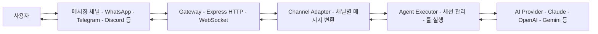
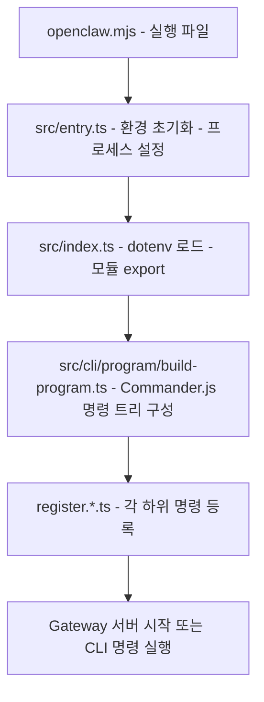
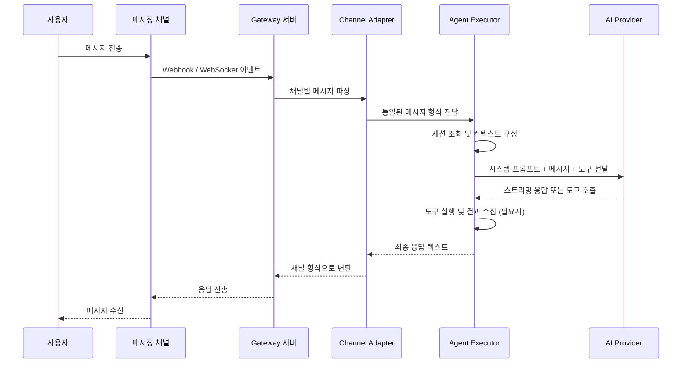

# 아키텍처 개요

OpenClaw은 메시징 채널에서 들어온 메시지를 AI 모델로 전달하고, 응답을 다시 채널로 돌려보내는 **멀티채널 AI 게이트웨이**입니다. 이 문서에서는 시스템의 전체 구조와 요청 처리 흐름을 살펴봅니다.

## 고수준 아키텍처

다음 다이어그램은 OpenClaw의 전체적인 메시지 흐름을 보여줍니다.



사용자가 WhatsApp, Telegram 등의 메시징 앱에서 보낸 메시지는 Gateway 서버를 통해 수신됩니다. Channel Adapter가 채널별 프로토콜을 통일된 형식으로 변환하고, Agent Executor가 AI 모델과 상호작용하여 응답을 생성합니다. 응답은 역순으로 사용자에게 전달됩니다.

## 핵심 레이어

OpenClaw은 다음 5개의 주요 레이어로 구성됩니다.

### 1. CLI 레이어 (Commander.js)

사용자가 터미널에서 `openclaw` 명령을 실행하면 가장 먼저 진입하는 레이어입니다. Commander.js 기반으로 구성되어 있으며, 서버 시작, 메시지 전송, 설정 관리 등의 하위 명령을 제공합니다.

주요 파일 위치는 `src/cli/program/` 디렉토리이며, `build-program.ts`에서 전체 CLI 명령 트리를 구성합니다. 각 명령은 `register.*.ts` 파일에서 등록됩니다.

```
src/cli/program/
  build-program.ts        # CLI 프로그램 빌드 진입점
  register.agent.ts       # agent 관련 명령 등록
  register.configure.ts   # 설정 관련 명령 등록
  register.message.ts     # 메시지 관련 명령 등록
  register.setup.ts       # 초기 설정 명령 등록
  register.subclis.ts     # 하위 CLI 명령 등록
```

### 2. Gateway 레이어 (Express HTTP/WebSocket)

Express 5 기반의 HTTP 서버와 WebSocket 서버가 동작하는 레이어입니다. 외부 메시징 채널의 Webhook을 수신하고, 네이티브 앱(macOS, iOS, Android)과 실시간 통신을 담당합니다.

Gateway는 인증, CORS, 속도 제한 등의 미들웨어를 포함하며, OpenAI 호환 API 엔드포인트도 제공합니다. `src/gateway/` 디렉토리에 위치합니다.

```
src/gateway/
  server.ts               # Gateway 서버 메인 진입점
  server-http.ts           # HTTP 라우팅 설정
  server-chat.ts           # 채팅 세션 관리
  server-channels.ts       # 채널 연동 관리
  openai-http.ts           # OpenAI 호환 API
  auth.ts                  # 인증 처리
  origin-check.ts          # Origin 검증
```

### 3. Channel Adapter 레이어

각 메시징 채널의 고유한 API와 프로토콜을 OpenClaw 내부 메시지 형식으로 변환하는 어댑터 레이어입니다. Adapter 패턴을 사용하여 채널별 차이를 추상화합니다.

채널 어댑터는 두 곳에 분산되어 있습니다.

- **내장 채널**: `src/telegram/`, `src/discord/`, `src/slack/`, `src/signal/`, `src/imessage/`, `src/whatsapp/`, `src/web/`, `src/line/` 등
- **확장 채널**: `extensions/` 디렉토리 (IRC, Matrix, Mattermost, MS Teams 등)

공통 채널 로직은 `src/channels/` 디렉토리에서 관리됩니다. `registry.ts`에서 채널을 등록하고, `channel-config.ts`에서 채널별 설정을 처리합니다.

### 4. Agent Executor 레이어

AI 모델과의 상호작용을 관리하는 핵심 레이어입니다. 세션 관리, 시스템 프롬프트 구성, 도구(tool) 실행, 컨텍스트 윈도우 관리, 메모리 검색 등을 담당합니다.

`src/agents/` 디렉토리에 위치하며, 이 레이어의 주요 구성 요소는 다음과 같습니다.

- `pi-embedded-runner.ts`: AI 모델 실행의 핵심 러너
- `pi-embedded-helpers.ts`: 메시지 sanitize, 오류 분류 등 헬퍼 함수
- `pi-embedded-subscribe.ts`: AI 응답 스트리밍 처리
- `pi-tools.ts`: 도구 정의 및 실행
- `system-prompt.ts`: 시스템 프롬프트 생성
- `skills.ts`: 스킬 로딩 및 관리
- `model-selection.ts`: 모델 선택 로직
- `auth-profiles.ts`: 인증 프로파일 관리

### 5. Config 시스템

Zod 4 스키마 기반의 설정 관리 시스템입니다. YAML/JSON 설정 파일을 로드하고 검증합니다. 에이전트별 설정, 채널별 설정, 모델 설정 등을 타입 안전하게 관리합니다.

`src/config/` 디렉토리에서 `config.ts`가 설정 로딩을 담당하고, 스키마 정의와 검증 로직이 함께 포함되어 있습니다.

## 엔트리 포인트 흐름

OpenClaw이 시작될 때의 코드 진입 흐름은 다음과 같습니다.



각 단계의 역할을 정리하면 다음과 같습니다.

| 파일                               | 역할                                                             |
| ---------------------------------- | ---------------------------------------------------------------- |
| `openclaw.mjs`                     | npm bin 엔트리. Node.js 실행 플래그 설정 후 `src/entry.ts` 호출  |
| `src/entry.ts`                     | 프로세스 타이틀 설정, 환경 변수 정규화, ExperimentalWarning 억제 |
| `src/index.ts`                     | dotenv 로드, 환경 정규화, CLI 경로 보장, 주요 모듈 re-export     |
| `src/cli/program/build-program.ts` | Commander.js 프로그램 생성 및 모든 하위 명령 등록                |

## 요청 처리 흐름

메시지가 도착해서 응답이 전송되기까지의 전체 흐름입니다.



### 흐름 상세 설명

1. **메시지 수신**: 사용자가 메시징 앱에서 메시지를 보내면, 해당 채널의 API가 Gateway 서버로 Webhook 이벤트를 전달합니다. WebSocket 기반 채널(네이티브 앱 등)은 실시간 연결을 통해 전달됩니다.

2. **채널 어댑터 처리**: Channel Adapter가 채널별 고유 형식(Telegram의 Update 객체, Discord의 Message 객체 등)을 OpenClaw 내부 메시지 형식으로 변환합니다. 이 과정에서 allowlist 확인, 멘션 감지, 대화 유형 판별 등이 수행됩니다.

3. **에이전트 실행**: Agent Executor가 세션을 조회하거나 생성하고, 시스템 프롬프트를 구성합니다. 사용 가능한 도구(스킬, 확장, 내장 도구)를 결정하고, AI 모델에 요청을 보냅니다.

4. **AI 모델 응답**: AI 모델이 텍스트 응답을 스트리밍하거나, 도구 호출을 요청합니다. 도구 호출이 있으면 Agent가 도구를 실행하고 결과를 다시 모델에 전달합니다. 이 과정은 최종 텍스트 응답이 나올 때까지 반복됩니다.

5. **응답 전송**: 최종 응답이 채널 어댑터를 통해 원래 채널의 형식으로 변환되고, Gateway를 거쳐 사용자에게 전달됩니다.

## 주요 디자인 패턴

OpenClaw 코드베이스에서 자주 사용되는 디자인 패턴들입니다.

### Adapter 패턴

각 메시징 채널의 고유한 API를 통일된 인터페이스로 추상화합니다. `src/channels/registry.ts`에서 채널을 등록하고, 각 채널 모듈(`src/telegram/`, `src/discord/` 등)이 동일한 인터페이스를 구현합니다.

이 패턴 덕분에 새로운 채널을 추가할 때 기존 코드를 수정하지 않고 새 어댑터만 작성하면 됩니다.

### Factory 패턴

설정 값에 따라 적절한 AI 프로바이더, 채널 어댑터, 도구 인스턴스를 생성합니다. 런타임에 어떤 구현체를 사용할지 결정하는 데 활용됩니다.

### Dependency Injection (`createDefaultDeps`)

`src/cli/deps.ts`의 `createDefaultDeps` 함수를 통해 시스템 전반의 의존성을 주입합니다. 이 패턴은 테스트에서 의존성을 mock으로 교체하기 쉽게 만들어 줍니다.

```typescript
// src/cli/deps.ts 에서 기본 의존성 생성
const deps = createDefaultDeps();
// 테스트에서는 특정 의존성을 override 가능
```

### Plugin Runtime (jiti)

`jiti`를 사용하여 TypeScript로 작성된 확장 모듈과 스킬을 런타임에 동적으로 로딩합니다. `src/plugins/` 디렉토리에서 플러그인 로딩 로직을 관리하며, `src/plugin-sdk/`에서 플러그인 개발자를 위한 공개 API를 제공합니다.

확장과 스킬은 별도의 빌드 과정 없이 TypeScript 소스 그대로 로딩되므로, 빠른 개발과 배포가 가능합니다.

### Event-Driven Architecture

`src/hooks/` 디렉토리의 이벤트 시스템을 통해 컴포넌트 간 느슨한 결합을 유지합니다. 메시지 수신, 도구 실행, 세션 변경 등의 이벤트를 발행하고 구독하는 방식으로 기능을 확장할 수 있습니다.

## 다음 단계

아키텍처의 전체적인 흐름을 이해했다면, 다음 문서인 **프로젝트 구조 가이드**에서 각 디렉토리와 파일의 구체적인 역할을 살펴보세요.
