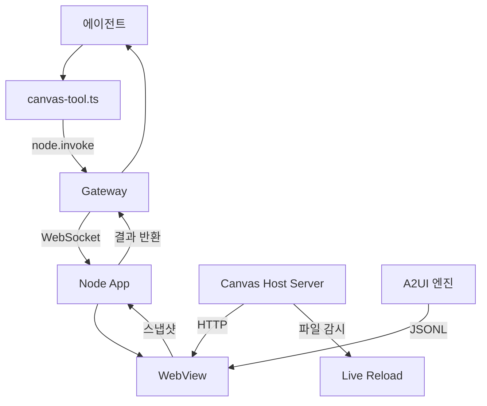
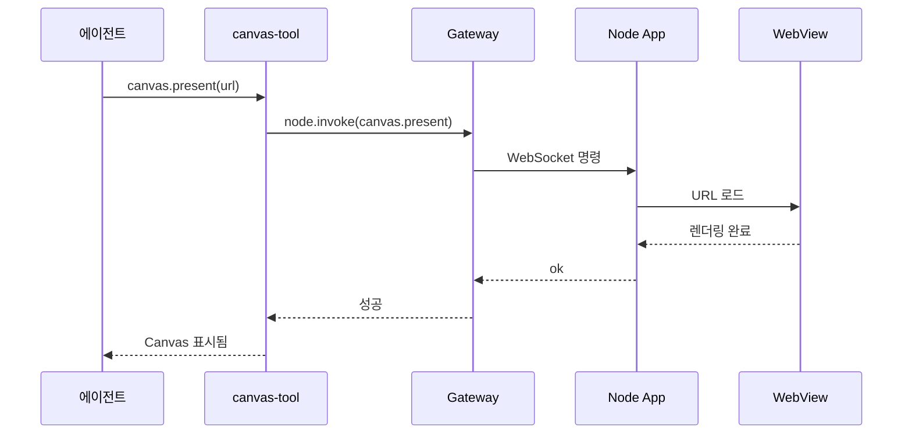

## Canvas란 무엇인가

Canvas는 에이전트가 사용자에게 시각적 UI를 보여주는 시스템입니다.
HTML/CSS/JS 또는 A2UI 프로토콜로 동적인 화면을 생성하고,
연결된 노드(Android, macOS, iOS)의 WebView에 렌더링합니다.

게임, 데이터 시각화, 대시보드, 인터랙티브 폼 등
텍스트만으로 표현하기 어려운 결과물을 보여줄 때 사용합니다.

## 전체 아키텍처



### 3계층 구조

```
Canvas Host (HTTP Server, Port 18793)
    ↓ HTML/CSS/JS 제공
Node Bridge (WebSocket)
    ↓ 명령 전달
Node App (Mac/iOS/Android WebView)
    ↓ 렌더링
```

## Canvas Host 서버

`src/canvas-host/server.ts`(515줄)에서 Canvas 파일을 제공하는 HTTP 서버를 운영합니다.

### 설정

```typescript
{
  "canvasHost": {
    "enabled": true,          // 기본: true
    "port": 18793,            // 기본 포트
    "root": "~/.openclaw/workspace/canvas",  // 파일 루트
    "liveReload": true        // 파일 변경 시 자동 새로고침
  }
}
```

### 주요 경로

| 경로                    | 용도                  |
| ----------------------- | --------------------- |
| `/__openclaw__/canvas/` | Canvas HTML 파일 서빙 |
| `/__openclaw__/a2ui/`   | A2UI 리소스           |
| `/__openclaw__/ws`      | Live Reload WebSocket |

### Live Reload

Canvas Host는 루트 디렉토리의 파일 변경을 감시합니다.
파일이 수정되면 WebSocket으로 연결된 모든 WebView에 리로드 신호를 보냅니다.

에이전트가 HTML 파일을 수정하면 사용자 화면에 즉시 반영됩니다.

## 에이전트 도구

`src/agents/tools/canvas-tool.ts`(180줄)에서 에이전트가 Canvas를 제어합니다.

### 지원 액션

| 액션         | 설명                       |
| ------------ | -------------------------- |
| `present`    | Canvas를 표시하고 URL 로드 |
| `hide`       | Canvas를 숨김              |
| `navigate`   | 새 URL로 이동              |
| `eval`       | JavaScript 코드 실행       |
| `snapshot`   | 화면 캡처 (PNG/JPEG)       |
| `a2ui_push`  | A2UI JSONL 데이터 전송     |
| `a2ui_reset` | A2UI 상태 초기화           |

### 도구 파라미터

```typescript
{
  action: string;        // 위 액션 중 하나
  node: string;          // 대상 노드 ID
  target?: string;       // URL (present, navigate)
  x?: number;            // 위치/크기 (present)
  y?: number;
  width?: number;
  height?: number;
  javaScript?: string;   // JS 코드 (eval)
  outputFormat?: string; // "png" | "jpg" (snapshot)
  jsonl?: string;        // A2UI 데이터 (a2ui_push)
  jsonlPath?: string;    // A2UI 파일 경로
}
```

### 호출 흐름



## A2UI (Agent-to-UI)

A2UI는 에이전트가 프로그래밍적으로 UI를 생성하는 프로토콜입니다.
`src/canvas-host/a2ui.ts`(219줄)에 구현되어 있습니다.

### JSONL 형식

A2UI는 JSONL(JSON Lines) 형식으로 UI 명령을 전달합니다.

```json
{"action":"beginRendering","surface":"main","version":"0.8"}
{"action":"surfaceUpdate","surface":"main","html":"<h1>Hello</h1>"}
{"action":"dataModelUpdate","surface":"main","data":{"count":42}}
```

### 지원 액션 (v0.8)

| 액션              | 설명                  |
| ----------------- | --------------------- |
| `beginRendering`  | 렌더링 세션 시작      |
| `surfaceUpdate`   | Surface HTML 업데이트 |
| `dataModelUpdate` | 데이터 모델 업데이트  |
| `deleteSurface`   | Surface 삭제          |

### 플랫폼 브릿지

A2UI는 각 플랫폼의 네이티브 브릿지를 통해 사용자 액션을 에이전트에 전달합니다.

<Tabs>
<Tab title="iOS">

```javascript
window.webkit.messageHandlers.openclawCanvasA2UIAction.postMessage(actionData);
```

</Tab>
<Tab title="Android">

```javascript
window.openclawCanvasA2UIAction.postMessage(actionData);
```

</Tab>
<Tab title="범용">

```javascript
window.OpenClaw.postMessage(actionData);
// 또는
window.openclawSendUserAction(actionData);
```

</Tab>
</Tabs>

## 플랫폼별 구현

### macOS

`apps/macos/Sources/OpenClaw/`에 1,819줄에 걸쳐 구현되어 있습니다.

| 파일                           | 역할                            |
| ------------------------------ | ------------------------------- |
| `CanvasWindowController.swift` | WKWebView 컨트롤러, A2UI 브릿지 |
| `CanvasManager.swift`          | 싱글톤, Canvas 패널 관리        |
| `CanvasSchemeHandler.swift`    | 커스텀 URL 스킴 핸들러          |

macOS Canvas 특징은 다음과 같습니다.

| 항목      | 값                                                         |
| --------- | ---------------------------------------------------------- |
| 저장 경로 | `~/Library/Application Support/OpenClaw/canvas/{session}/` |
| URL 스킴  | `openclaw-canvas://{session}/{path}`                       |
| 동시 패널 | 1개 (세션 전환 시 자동 교체)                               |
| 보안      | 디렉토리 탐색 차단                                         |

### Android

`CanvasController.kt`(240줄)에서 Android WebView를 관리합니다.

| 기능      | 구현                                                 |
| --------- | ---------------------------------------------------- |
| URL 로드  | `WebView.loadUrl()`                                  |
| JS 실행   | `WebView.evaluateJavascript()`                       |
| 스냅샷    | `WebView.draw(Canvas)` -> Bitmap -> Base64           |
| 스캐폴드  | `file:///android_asset/CanvasScaffold/scaffold.html` |
| JPEG 품질 | 0.1~1.0 → 1~100 변환                                 |

### iOS

`RootCanvas.swift`와 `NodeAppModel+Canvas.swift`에서 구현합니다.

Gateway 연결 시 자동으로 A2UI 페이지를 표시하고,
연결 해제 시 기본 Canvas로 복귀합니다.
루프백 주소 필터링으로 iOS에서 localhost 접근 문제를 방지합니다.

## 스냅샷

에이전트가 Canvas의 현재 상태를 이미지로 캡처할 수 있습니다.

```typescript
// 스냅샷 결과 타입
type CanvasSnapshotPayload = {
  format: "png" | "jpeg";
  base64: string; // Base64 인코딩된 이미지
};
```

스냅샷은 임시 파일로 저장되어 에이전트가 분석하거나 사용자에게 전달할 수 있습니다.

## CLI 명령어

`src/cli/nodes-cli/register.canvas.ts`(262줄)에서 CLI를 통한 Canvas 제어를 지원합니다.

```bash
# Canvas 표시
openclaw nodes canvas present --node <id> --target <url>

# Canvas 숨기기
openclaw nodes canvas hide --node <id>

# URL 이동
openclaw nodes canvas navigate --node <id> <url>

# JavaScript 실행
openclaw nodes canvas eval --node <id> --js "document.title"

# 스냅샷 캡처
openclaw nodes canvas snapshot --node <id> --format png

# A2UI 데이터 전송
openclaw nodes canvas a2ui push --node <id> --jsonl <path>

# A2UI 초기화
openclaw nodes canvas a2ui reset --node <id>
```

## Canvas Skill

`skills/canvas/SKILL.md`(199줄)에 Canvas 스킬이 정의되어 있습니다.
이 스킬을 활성화하면 에이전트가 Canvas 도구를 사용할 수 있습니다.

<Info>
  Canvas Host의 URL은 Gateway bind 모드에 따라 달라집니다. loopback 모드에서는 `127.0.0.1`,
  LAN/Tailnet 모드에서는 호스트명을 사용합니다.
</Info>

## 소스 구조 요약

```
src/
  canvas-host/
    server.ts                       # HTTP 서버 (515줄)
    a2ui.ts                         # A2UI 프로토콜 (219줄)
  agents/tools/
    canvas-tool.ts                  # 에이전트 도구 (180줄)
  cli/
    nodes-canvas.ts                 # 스냅샷 헬퍼 (35줄)
    nodes-cli/
      register.canvas.ts           # CLI 명령어 (262줄)
      a2ui-jsonl.ts                 # JSONL 검증 (90줄)
  infra/
    canvas-host-url.ts              # URL 해석 (67줄)

apps/
  macos/Sources/OpenClaw/Canvas*    # macOS WebView (1,819줄)
  android/.../CanvasController.kt   # Android WebView (240줄)
  ios/Sources/RootCanvas.swift      # iOS Canvas

skills/
  canvas/SKILL.md                   # 스킬 정의 (199줄)
```

## 관련 문서

<CardGroup cols={3}>
  <Card title="Node 아키텍처" icon="sitemap" href="/node-architecture">
    Canvas 명령이 전달되는 노드 RPC 시스템을 설명합니다.
  </Card>
  <Card title="Android Node" icon="mobile" href="/android-node">
    Android WebView Canvas 구현을 다룹니다.
  </Card>
  <Card title="macOS Node" icon="desktop" href="/macos-node">
    macOS WKWebView Canvas 구현을 다룹니다.
  </Card>
</CardGroup>
