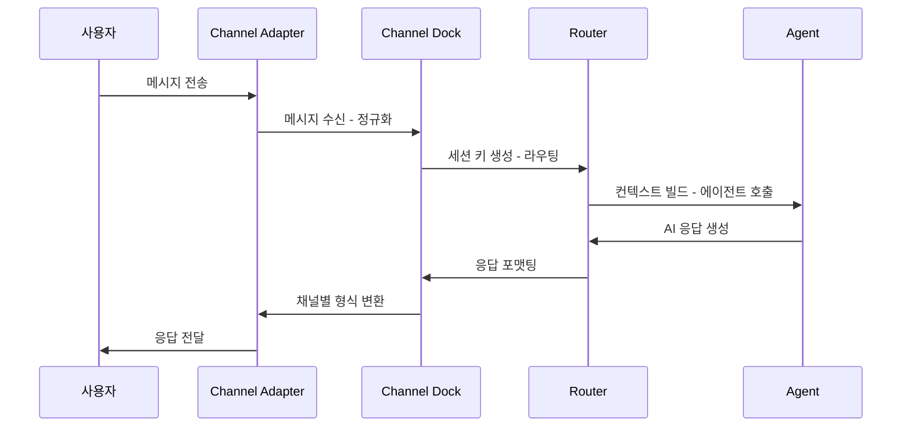

## Channel이란 무엇인가

Channel은 메시징 플랫폼과 OpenClaw를 연결하는 어댑터입니다.
Telegram에서 온 메시지든, Discord에서 온 메시지든, 동일한 인터페이스를 통해
에이전트에 전달됩니다. 새로운 메시징 플랫폼을 추가하려면 Channel 어댑터를 구현하면 됩니다.

## 채널 아키텍처

채널 관련 코드는 두 곳에 분산되어 있습니다.

- `src/channels/` -- 채널 공통 인프라 (dock, registry, allowlists, plugins)
- `src/telegram/`, `src/discord/`, `src/slack/` 등 -- 각 채널별 구현체
- `extensions/` -- 확장 채널 플러그인

### 핵심 파일

| 파일                   | 역할                                                                                           |
| ---------------------- | ---------------------------------------------------------------------------------------------- |
| `channels/dock.ts`     | 채널 도킹 시스템 (524 LOC). 각 채널의 capabilities, 명령어, 스트리밍, 그룹 정책 등을 통합 관리 |
| `channels/registry.ts` | 채널 메타데이터 레지스트리. 채널 순서, 라벨, 문서 경로 등 정의                                 |
| `channels/allowlists/` | 채널별 허용 목록 관리                                                                          |
| `channels/plugins/`    | 채널 플러그인 타입 정의 및 공통 유틸리티                                                       |
| `routing/`             | 메시지 라우팅. 세션 키 생성, 바인딩 규칙 처리                                                  |

## 내장 채널

OpenClaw에 기본 포함된 채널들입니다.

| 채널     | 디렉토리        | 라이브러리      | 설명                                                            |
| -------- | --------------- | --------------- | --------------------------------------------------------------- |
| Telegram | `src/telegram/` | grammy          | 가장 쉽게 시작할 수 있는 채널. BotFather로 봇 등록 후 바로 사용 |
| WhatsApp | `src/web/`      | whatsapp-web.js | QR 코드 링크 방식. 별도 전화번호와 eSIM 권장                    |
| Discord  | `src/discord/`  | discord.js      | Bot API 기반. 서버 및 DM 지원                                   |
| Slack    | `src/slack/`    | @slack/bolt     | Slack 앱으로 동작. 워크스페이스 설치 필요                       |
| Signal   | `src/signal/`   | signal-cli      | Signal 프로토콜 기반 보안 메시징                                |
| iMessage | `src/imessage/` | BlueBubbles     | macOS 전용. BlueBubbles 서버 필요                               |

채널 우선순위 순서는 `registry.ts`에 정의되어 있습니다.

```typescript
export const CHAT_CHANNEL_ORDER = [
  "telegram",
  "whatsapp",
  "discord",
  "irc",
  "googlechat",
  "slack",
  "signal",
  "imessage",
] as const;
```

## 확장 채널

`extensions/` 디렉토리에 35개의 확장 모듈이 있으며, 그중 다수가 채널 플러그인입니다.

| 확장 채널      | 디렉토리                     |
| -------------- | ---------------------------- |
| MS Teams       | `extensions/msteams/`        |
| Matrix         | `extensions/matrix/`         |
| Feishu (Lark)  | `extensions/feishu/`         |
| Google Chat    | `extensions/googlechat/`     |
| Mattermost     | `extensions/mattermost/`     |
| LINE           | `extensions/line/`           |
| IRC            | `extensions/irc/`            |
| Zalo           | `extensions/zalo/`           |
| Nostr          | `extensions/nostr/`          |
| Twitch         | `extensions/twitch/`         |
| Nextcloud Talk | `extensions/nextcloud-talk/` |

확장 채널은 플러그인 시스템을 통해 동적으로 로드됩니다.
설정 파일에서 해당 채널을 활성화하면 자동으로 사용 가능합니다.

## 채널 플러그인 인터페이스

모든 채널은 `ChannelPlugin` 인터페이스를 구현합니다.
`plugin-sdk`에서 export되는 주요 어댑터 타입들을 살펴보겠습니다.

```typescript
// 채널이 구현할 수 있는 어댑터들
type ChannelPlugin = {
  id: ChannelId;
  capabilities: ChannelCapabilities;
  setup?: ChannelSetupAdapter; // 채널 초기 설정
  messaging?: ChannelMessagingAdapter; // 메시지 송수신
  outbound?: ChannelOutboundAdapter; // 발신 메시지 처리
  streaming?: ChannelStreamingAdapter; // 실시간 스트리밍
  commands?: ChannelCommandAdapter; // 채널 명령어
  security?: ChannelSecurityAdapter; // 보안 정책
  heartbeat?: ChannelHeartbeatAdapter; // 상태 확인
  threading?: ChannelThreadingAdapter; // 스레드 지원
  groups?: ChannelGroupAdapter; // 그룹 채팅 지원
  mentions?: ChannelMentionAdapter; // 멘션 처리
};
```

각 어댑터는 선택적이므로, 채널이 지원하는 기능만 구현하면 됩니다.

## 메시지 흐름

사용자 메시지가 에이전트에 도달하고 응답이 돌아오는 전체 흐름입니다.



### 라우팅 처리

`src/routing/` 디렉토리에서 메시지 라우팅을 담당합니다.

- `session-key.ts` -- 채널 + 계정 + 대상 조합으로 고유한 세션 키를 생성
- `resolve-route.ts` -- 바인딩 규칙에 따라 적절한 에이전트를 결정
- `bindings.ts` -- 채널-에이전트 바인딩 설정 관리

세션 키는 `{channel}:{accountId}:{targetId}` 형태로, 같은 사용자의 같은 채널 대화는
항상 동일한 세션으로 연결됩니다.

## Allowlist와 보안

각 채널은 allowlist를 통해 허용된 사용자만 접근할 수 있도록 제한합니다.

```yaml
# config.yaml 예시
telegram:
  allowFrom:
    - 123456789 # Telegram user ID
    - 987654321

discord:
  allowFrom:
    - "user-id-here"
```

`channels/allowlists/` 디렉토리에서 채널별 allowlist 매칭 로직을 관리합니다.
`allowlist-match.ts`에서 수신 메시지의 발신자를 허용 목록과 대조합니다.

## 그룹 채팅 지원

그룹 채팅에서는 멘션 기반 활성화가 기본입니다.
봇이 멘션되었을 때만 응답하도록 `mention-gating.ts`에서 제어합니다.

그룹별 도구 정책도 별도로 설정할 수 있습니다.
민감한 도구(bash 실행 등)는 그룹에서 비활성화하고 DM에서만 허용하는 식입니다.

```typescript
// dock.ts에서 그룹 정책 해석
type ChannelDock = {
  id: ChannelId;
  capabilities: ChannelCapabilities;
  commands?: ChannelCommandAdapter;
  streaming?: ChannelDockStreaming;
  elevated?: ChannelElevatedAdapter;
};
```

## 채널 추가 시 체크리스트

새 채널을 추가하려면 다음을 수행해야 합니다.

1. `ChannelPlugin` 인터페이스를 구현하는 모듈을 작성합니다
2. `channels/registry.ts`의 `CHAT_CHANNEL_ORDER`에 채널 ID를 등록합니다
3. 채널 메타데이터(라벨, 문서 경로, 설명)를 추가합니다
4. `dock.ts`에 채널의 capabilities와 어댑터를 등록합니다
5. 설정 스키마(`config/zod-schema.providers.ts`)에 채널 설정을 추가합니다

확장 채널의 경우 `extensions/` 디렉토리에 별도 패키지로 만들고,
플러그인 시스템을 통해 등록합니다.

## 핵심 요약

Channel 시스템은 OpenClaw의 외부 세계와의 접점입니다.
공통 인터페이스 덕분에 에이전트는 어떤 플랫폼에서 메시지가 왔는지 신경 쓸 필요가 없습니다.
내장 6개 채널과 확장 채널을 합치면 15개 이상의 메시징 플랫폼을 지원하며,
플러그인 시스템으로 누구나 새로운 채널을 추가할 수 있습니다.
