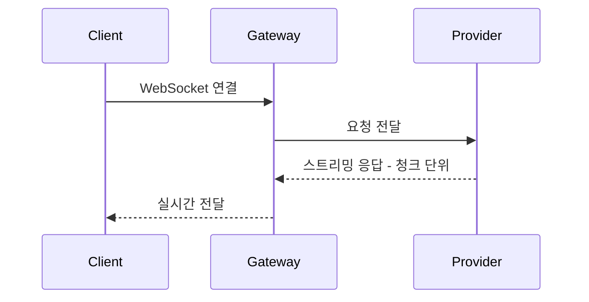

# Code Patterns

OpenClaw 코드베이스에서 일관되게 사용하는 패턴과 컨벤션입니다.
새 코드를 작성할 때 이 가이드를 참고하세요.

## TypeScript 컨벤션

OpenClaw은 TypeScript 5.9를 strict 모드로 사용하며, 모든 모듈은 ESM입니다.

### 핵심 규칙

- **strict 모드 필수**: `tsconfig.json`에서 strict가 활성화되어 있습니다.
- **`any` 사용 금지**: 타입이 불확실하면 `unknown`을 사용하고 타입 가드로 좁히세요.
- **ESM 모듈**: `import`/`export` 구문만 사용합니다. CommonJS(`require`)는 사용하지 않습니다.
- **파일 크기**: 한 파일은 500-700 LOC 이하를 유지하세요. 이를 초과하면 분리를 고려합니다.

<Tabs>
<Tab title="Good">
```typescript
import { z } from "zod";

const UserSchema = z.object({
name: z.string(),
age: z.number().int().positive(),
});

type User = z.infer<typeof UserSchema>;

export function parseUser(data: unknown): User {
  return UserSchema.parse(data);
}
```
</Tab>
<Tab title="Bad">
```typescript
// any 사용 금지
function parseUser(data: any): any {
  return data;
}

// CommonJS 사용 금지
const z = require("zod");

````
</Tab>
</Tabs>

## 의존성 주입 (Dependency Injection)

OpenClaw은 `createDefaultDeps()` 패턴을 사용해 의존성을 주입합니다.
이 패턴은 `src/cli/deps.js`에서 확인할 수 있습니다.

```typescript
// 의존성 타입 정의
interface Deps {
  logger: Logger;
  config: Config;
  httpClient: HttpClient;
}

// 기본 의존성 생성
function createDefaultDeps(): Deps {
  return {
    logger: createLogger(),
    config: loadConfig(),
    httpClient: createHttpClient(),
  };
}

// 사용 시 의존성 주입
function createApp(deps: Deps = createDefaultDeps()) {
  // deps를 통해 모든 의존성에 접근
}
````

테스트에서는 mock 의존성을 주입할 수 있어 단위 테스트가 용이합니다.

<Tabs>
<Tab title="Good">
```typescript
// 테스트에서 mock 주입
const mockDeps: Deps = {
  logger: createMockLogger(),
  config: testConfig,
  httpClient: createMockHttpClient(),
};

const app = createApp(mockDeps);

````
</Tab>
<Tab title="Bad">
```typescript
// 전역 상태에 직접 의존하면 테스트가 어려움
import { globalLogger } from "./globals";

function createApp() {
  globalLogger.info("starting...");
}
````

</Tab>
</Tabs>

## 어댑터 패턴 (Adapter Pattern)

채널 어댑터는 공통 인터페이스를 구현합니다. 새로운 채널을 추가할 때 이 인터페이스를 따르면 됩니다.

```typescript
// 공통 채널 인터페이스
interface ChannelAdapter {
  send(message: Message): Promise<void>;
  receive(): AsyncIterable<IncomingMessage>;
  disconnect(): Promise<void>;
}

// 구체적인 어댑터 구현
class WebSocketAdapter implements ChannelAdapter {
  async send(message: Message): Promise<void> {
    // WebSocket 전송 로직
  }

  async *receive(): AsyncIterable<IncomingMessage> {
    // WebSocket 수신 로직
  }

  async disconnect(): Promise<void> {
    // 연결 해제
  }
}
```

## 팩토리 패턴 (Factory Pattern)

채널과 프로바이더 생성에는 팩토리 패턴을 사용합니다.

```typescript
// 채널 팩토리
function createChannel(type: ChannelType, config: ChannelConfig): ChannelAdapter {
  switch (type) {
    case "websocket":
      return new WebSocketAdapter(config);
    case "http":
      return new HttpAdapter(config);
    default:
      throw new Error(`Unknown channel type: ${type}`);
  }
}
```

## 스트리밍 아키텍처

OpenClaw은 WebSocket 기반 스트리밍을 사용합니다. 응답이 생성되는 대로 클라이언트에 전달됩니다.



## 플러그인 런타임

플러그인은 jiti를 통한 동적 모듈 로딩으로 실행됩니다.

```typescript
// 플러그인 동적 로드 예시
import { createJiti } from "jiti";

const jiti = createJiti(import.meta.url);
const plugin = await jiti.import("./my-plugin.ts");
```

플러그인은 런타임에 로드되므로 빌드 타임 의존성 없이 확장이 가능합니다.

## 에러 처리

전역 에러 핸들러와 `formatUncaughtError` 유틸리티를 사용합니다.

<Tabs>
<Tab title="Good">
```typescript
import { formatUncaughtError } from "./errors";

process.on("uncaughtException", (error) => {
const formatted = formatUncaughtError(error);
logger.error(formatted);
process.exit(1);
});

// 비즈니스 로직에서는 구체적인 에러 타입 사용
class ConfigValidationError extends Error {
constructor(message: string) {
super(message);
this.name = "ConfigValidationError";
}
}

````
</Tab>
<Tab title="Bad">
```typescript
// 에러를 무시하거나 문자열로 throw하지 마세요
try {
  doSomething();
} catch {
  // 무시
}

throw "something went wrong";
````

</Tab>
</Tabs>

## Config 검증

Zod 스키마를 사용해 설정값의 타입 안전성을 보장합니다.

```typescript
import { z } from "zod";

const ServerConfigSchema = z.object({
  port: z.number().int().min(1).max(65535).default(3000),
  host: z.string().default("localhost"),
  cors: z.object({
    origin: z.string().url(),
    credentials: z.boolean().default(true),
  }),
});

type ServerConfig = z.infer<typeof ServerConfigSchema>;

// 설정 로드 시 검증
const config = ServerConfigSchema.parse(rawConfig);
```

## 네이밍 컨벤션

| 대상           | 규칙        | 예시                 |
| -------------- | ----------- | -------------------- |
| 제품명         | PascalCase  | OpenClaw             |
| CLI / 패키지명 | lowercase   | `openclaw`           |
| 파일명         | kebab-case  | `channel-adapter.ts` |
| 클래스         | PascalCase  | `WebSocketAdapter`   |
| 함수 / 변수    | camelCase   | `createChannel`      |
| 상수           | UPPER_SNAKE | `MAX_RETRY_COUNT`    |

## 코드 품질 도구

| 도구   | 용도        | 명령어            |
| ------ | ----------- | ----------------- |
| oxfmt  | 코드 포매팅 | `pnpm format:fix` |
| oxlint | 코드 린팅   | `pnpm check`      |

`pnpm check`를 실행하면 oxfmt과 oxlint가 함께 동작하여 코드 스타일과 잠재적 문제를 검사합니다.
PR 제출 전에 반드시 실행하세요.
