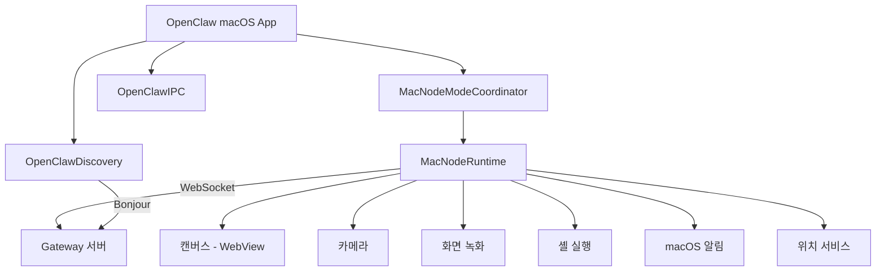

## macOS Node 개요

macOS Node는 메뉴바 앱으로 실행되며, 데스크톱 환경의 기능을 에이전트에게 제공합니다.
Swift와 SwiftUI로 구현되어 있고, `apps/macos/`에 위치합니다.

| 항목      | 값                    |
| --------- | --------------------- |
| 언어      | Swift                 |
| UI        | SwiftUI               |
| 최소 버전 | macOS 15+             |
| 빌드      | Swift Package Manager |
| 코드 서명 | Sparkle               |

## 듀얼 모드 런타임

macOS 앱은 두 가지 모드로 동작합니다.

<Tabs>
  <Tab title="Gateway 모드">
    앱 자체가 Gateway 서버를 내장하여 독립 실행합니다. 별도의 서버 없이 macOS에서 OpenClaw를 바로
    사용할 수 있습니다.
  </Tab>
  <Tab title="Node 모드">
    원격 Gateway에 노드로 연결됩니다. 기존 Gateway 서버가 있을 때 macOS의 기능을 추가로 제공합니다.
  </Tab>
</Tabs>

## 아키텍처



## MacNodeRuntime

`MacNodeRuntime.swift`(969줄)이 핵심 런타임입니다.

### 지원 능력

| 능력       | 명령어                        | 설명                     |
| ---------- | ----------------------------- | ------------------------ |
| `canvas`   | `canvas.*`                    | WebView 기반 UI 렌더링   |
| `camera`   | `camera.*`                    | 사진/동영상 촬영         |
| `screen`   | `screen.*`                    | 화면 녹화                |
| `system`   | `system.run`, `system.notify` | 셸 명령 실행, macOS 알림 |
| `location` | `location.get`                | 사용자 위치              |

### Android와의 차이

| 기능                         | Android | macOS  |
| ---------------------------- | ------- | ------ |
| 셸 실행 (`system.run`)       | 미지원  | 지원   |
| macOS 알림 (`system.notify`) | 미지원  | 지원   |
| SMS 전송                     | 지원    | 미지원 |
| 음성 깨우기                  | 지원    | 미지원 |
| Talk 모드                    | 지원    | 미지원 |

## 셸 실행 (system.run)

macOS Node의 가장 강력한 기능입니다. 에이전트가 macOS 터미널 명령을 실행할 수 있습니다.

### 실행 승인 시스템

보안을 위해 승인 프레임워크가 내장되어 있습니다.

| 모드        | 설명                        |
| ----------- | --------------------------- |
| `allowlist` | 허용된 명령만 실행 (기본값) |
| `deny`      | 모든 실행 차단              |
| `full`      | 모든 명령 허용 (주의 필요)  |

```bash
# 에이전트가 실행 요청
system.run: { cmd: "ls -la ~/Documents", timeout: 30000 }

# 승인 시스템 확인 후 실행
# 결과를 에이전트에 반환
```

<Warning>
  `full` 모드는 에이전트가 제한 없이 명령을 실행할 수 있습니다. 신뢰할 수 있는 환경에서만
  사용하세요.
</Warning>

## Node 모드 컴포넌트

### MacNodeModeCoordinator

`MacNodeModeCoordinator.swift`(7.1KB)가 노드 모드의 생명주기를 관리합니다.

| 역할      | 설명                            |
| --------- | ------------------------------- |
| 연결 관리 | Gateway WebSocket 연결/재연결   |
| 상태 추적 | 연결 상태, 페어링 상태 모니터링 |
| 능력 등록 | 지원 기능을 Gateway에 광고      |

### MainActor 서비스

`MacNodeRuntimeMainActorServices.swift`(1.8KB)에서 메인 스레드가 필요한 작업을 처리합니다.
macOS의 UI 관련 API(캔버스, 알림 등)는 메인 스레드에서만 호출 가능하기 때문입니다.

### 위치 서비스

`MacNodeLocationService.swift`(4.3KB)에서 CoreLocation을 사용합니다.

## Discovery (자동 발견)

`OpenClawDiscovery` 라이브러리에서 Bonjour(Apple의 mDNS 구현)로 LAN 내 Gateway를 발견합니다.

```
1. Bonjour 서비스 브라우징 시작
2. OpenClaw Gateway 서비스 발견
3. 서비스 resolve로 IP/포트 확인
4. WebSocket 연결 수립
```

## IPC (프로세스 간 통신)

`OpenClawIPC` 라이브러리에서 프로세스 간 통신을 담당합니다.

Gateway 모드에서 앱과 내장 Gateway 사이의 통신에 사용됩니다.
Unix 소켓을 통해 실행 승인 요청/응답을 교환합니다.

## 빌드 타겟

| 타겟                              | 유형       | 설명                |
| --------------------------------- | ---------- | ------------------- |
| `OpenClaw`                        | 실행 파일  | 메뉴바 앱           |
| `OpenClawMacCLI` (`openclaw-mac`) | CLI        | 디버그용 커맨드라인 |
| `OpenClawIPC`                     | 라이브러리 | Gateway 통합 IPC    |
| `OpenClawDiscovery`               | 라이브러리 | mDNS 발견           |

## Headless Node와의 관계

macOS는 GUI 앱 외에도 Headless Node Host로 실행할 수 있습니다.
`src/node-host/runner.ts`(1,288줄)가 Node.js 기반 경량 런타임입니다.

```bash
# Headless 모드로 실행
openclaw node run --host gateway.local --port 18789

# 시스템 서비스로 설치 (launchd)
openclaw node install
```

Headless 모드는 `system.run`만 지원하며, 카메라나 캔버스 등 GUI 기능은 사용할 수 없습니다. GUI 기능이 필요하면 macOS 앱을 사용하세요.

## 소스 구조

```
apps/macos/Sources/
  OpenClaw/
    NodeMode/
      MacNodeRuntime.swift              # 핵심 런타임 (969줄)
      MacNodeModeCoordinator.swift      # 연결 관리 (7.1KB)
      MacNodeRuntimeMainActorServices.swift  # UI 스레드 (1.8KB)
      MacNodeScreenCommands.swift       # 화면 녹화
      MacNodeLocationService.swift      # GPS (4.3KB)
  OpenClawIPC/                          # IPC 라이브러리
  OpenClawDiscovery/                    # Bonjour 발견
```

## 관련 문서

<CardGroup cols={2}>
  <Card title="Node 아키텍처" icon="sitemap" href="/node-architecture">
    노드 시스템의 전체 아키텍처를 설명합니다.
  </Card>
  <Card title="Android Node" icon="mobile" href="/android-node">
    Android 노드 구현과 비교해 보세요.
  </Card>
</CardGroup>
