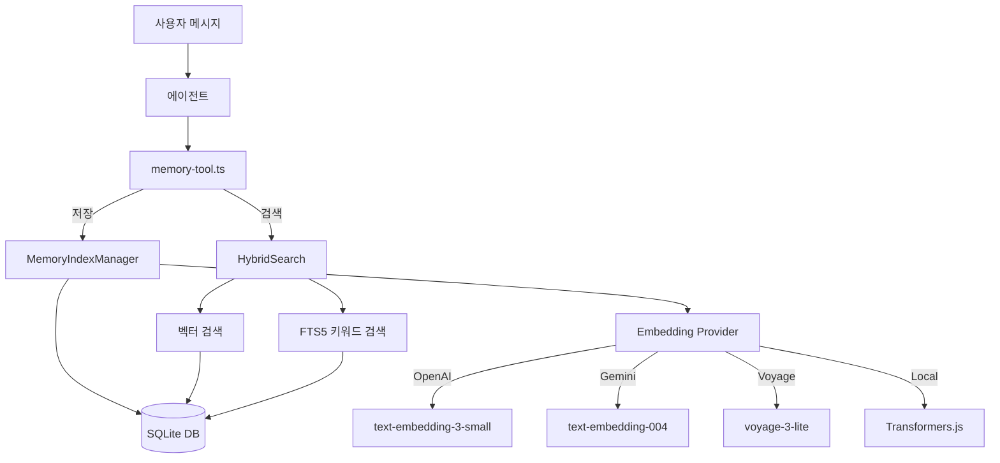
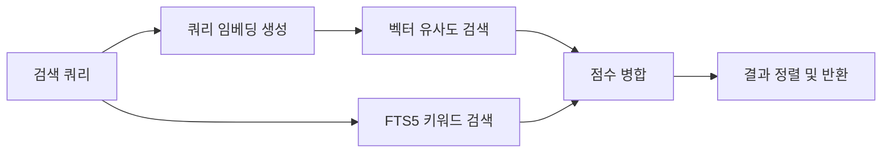

## 메모리란 무엇인가

메모리는 에이전트가 과거 대화와 사실을 기억하고 활용할 수 있게 해주는 시스템입니다.
단순한 대화 히스토리가 아니라, 임베딩 기반 벡터 검색과 키워드 검색을 결합한
하이브리드 검색 엔진입니다.

`src/memory/` 디렉토리에 11,500줄 이상의 코드로 구현되어 있습니다.

## 아키텍처 개요



## 핵심 컴포넌트

### MemoryIndexManager

메모리 시스템의 핵심 클래스입니다. `src/memory/index.ts`에 정의되어 있으며
2,300줄 이상의 코드로 구성됩니다.

주요 책임은 다음과 같습니다.

| 기능            | 설명                                         |
| --------------- | -------------------------------------------- |
| 문서 인덱싱     | 텍스트를 청크로 분할하고 임베딩 생성 후 저장 |
| 하이브리드 검색 | 벡터 유사도 + FTS5 키워드 검색 결합          |
| 임베딩 캐시     | 동일 텍스트의 중복 임베딩 생성 방지          |
| 자동 재인덱싱   | 설정 변경 시 기존 데이터 재처리              |

### 데이터베이스 스키마

SQLite 기반으로 6개의 테이블을 사용합니다.

```sql
-- 원본 파일/문서 메타데이터
CREATE TABLE files (
  id INTEGER PRIMARY KEY,
  path TEXT UNIQUE,
  hash TEXT,
  indexed_at INTEGER
);

-- 텍스트 청크 (분할된 단위)
CREATE TABLE chunks (
  id INTEGER PRIMARY KEY,
  file_id INTEGER REFERENCES files(id),
  content TEXT,
  chunk_index INTEGER
);

-- 벡터 임베딩 (vec0 확장)
CREATE VIRTUAL TABLE chunks_vec USING vec0(
  chunk_id INTEGER PRIMARY KEY,
  embedding FLOAT[dims]
);

-- 전문 검색 인덱스
CREATE VIRTUAL TABLE chunks_fts USING fts5(
  content,
  content_rowid=id
);

-- 임베딩 캐시
CREATE TABLE embedding_cache (
  hash TEXT PRIMARY KEY,
  embedding BLOB
);

-- 메타데이터
CREATE TABLE meta (
  key TEXT PRIMARY KEY,
  value TEXT
);
```

## 임베딩 파이프라인

### 지원 프로바이더

<Tabs>
<Tab title="OpenAI">
모델: `text-embedding-3-small` (1536차원)

가장 널리 사용되는 프로바이더입니다. API 키만 설정하면 바로 사용 가능합니다.

```typescript
// 설정 예시
{
  "memory": {
    "embeddingProvider": "openai",
    "embeddingModel": "text-embedding-3-small"
  }
}
```

</Tab>
<Tab title="Gemini">
모델: `text-embedding-004` (768차원)

Google AI Studio API를 사용합니다.

```typescript
{
  "memory": {
    "embeddingProvider": "gemini",
    "embeddingModel": "text-embedding-004"
  }
}
```

</Tab>
<Tab title="Voyage">
모델: `voyage-3-lite` (512차원)

경량 모델로 빠른 응답이 특징입니다.

</Tab>
<Tab title="Local">
Transformers.js를 사용한 로컬 임베딩입니다.

외부 API 호출 없이 로컬에서 임베딩을 생성합니다. 인터넷 연결 없이도 동작하지만 속도가 느릴 수 있습니다.

</Tab>
</Tabs>

### 임베딩 생성 흐름

<Steps>
  <Step title="텍스트 분할">
    입력 텍스트를 적절한 크기의 청크로 분할합니다. 청크 크기와 오버랩은 설정으로 조절 가능합니다.
  </Step>
  <Step title="캐시 확인">
    각 청크의 해시를 계산하고, `embedding_cache` 테이블에서 기존 임베딩을 확인합니다. 캐시에 있으면
    API 호출을 건너뜁니다.
  </Step>
  <Step title="임베딩 생성">
    캐시에 없는 청크만 선택한 프로바이더의 API로 임베딩을 생성합니다. 배치 처리로 효율을 높입니다.
  </Step>
  <Step title="저장">
    생성된 임베딩을 `chunks_vec` 테이블에, 원문을 `chunks_fts`에 저장합니다. 임베딩은
    `embedding_cache`에도 캐시합니다.
  </Step>
</Steps>

## 하이브리드 검색

하이브리드 검색은 벡터 검색과 키워드 검색을 결합하여 정확도를 높이는 방식입니다.
`src/memory/hybrid.ts`에 구현되어 있습니다.

### 검색 가중치

기본 가중치 비율은 다음과 같습니다.

```
벡터 검색 가중치: 0.6 (의미적 유사도)
키워드 검색 가중치: 0.4 (정확한 키워드 매칭)
```

### 검색 프로세스



벡터 검색은 코사인 유사도를 사용하여 의미적으로 유사한 청크를 찾고,
FTS5 검색은 정확한 키워드 매칭으로 관련 청크를 찾습니다.
두 결과를 가중치 비율로 병합하여 최종 순위를 결정합니다.

## QMD 메모리 백엔드

`src/memory/qmd/`에는 대안 메모리 백엔드인 QMD(Query-Markdown)가 구현되어 있습니다.

QMD는 마크다운 파일 기반 메모리 시스템으로,
파일 시스템에 직접 메모리를 저장합니다.
SQLite 기반 시스템보다 단순하지만, 사람이 직접 읽고 편집할 수 있는 장점이 있습니다.

## 메모리 도구

에이전트는 `memory-tool.ts`를 통해 메모리에 접근합니다.

| 작업            | 설명                        |
| --------------- | --------------------------- |
| `memory_store`  | 새로운 정보를 메모리에 저장 |
| `memory_search` | 관련 기억을 검색하여 반환   |
| `memory_delete` | 특정 메모리를 삭제          |

에이전트가 대화 중 중요한 정보를 발견하면 자율적으로 메모리에 저장하고,
질문에 답할 때 관련 기억을 검색하여 컨텍스트에 포함합니다.

## 관련 문서

메모리 시스템과 함께 이해하면 좋은 문서들입니다.

<CardGroup cols={2}>
  <Card title="세션 시스템" icon="clock-rotate-left" href="/session">
    대화 히스토리 저장과 세션 관리를 다룹니다.
  </Card>
  <Card title="Agent 시스템" icon="robot" href="/agents">
    메모리를 활용하는 에이전트 실행 루프를 설명합니다.
  </Card>
</CardGroup>
