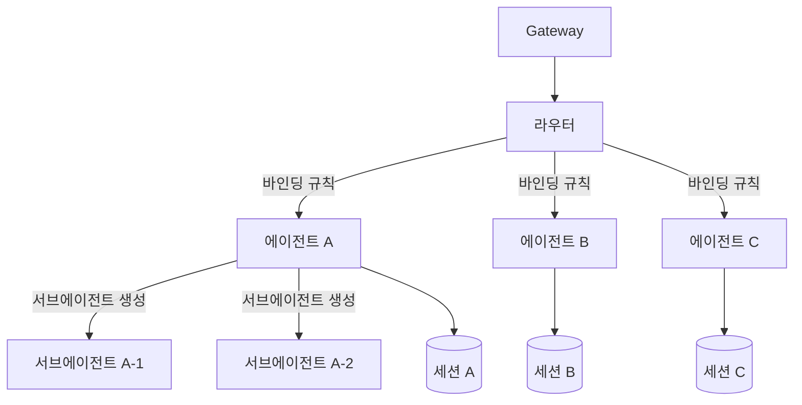
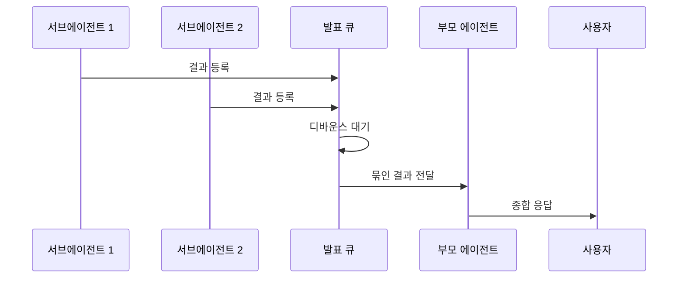

## 멀티 에이전트란

OpenClaw는 하나의 인스턴스에서 여러 에이전트를 동시에 운영할 수 있습니다.
각 에이전트는 독립적인 시스템 프롬프트, 도구 설정, 세션을 가집니다.

채널별로 다른 에이전트를 연결하거나, 한 에이전트가 다른 에이전트를 서브에이전트로 실행할 수 있습니다.

## 아키텍처



## 에이전트 스코프

`src/agents/agent-scope.ts`(192줄)에서 에이전트 식별과 디렉토리 구조를 관리합니다.

### 핵심 함수

| 함수                      | 설명                              |
| ------------------------- | --------------------------------- |
| `listAgentIds()`          | 등록된 모든 에이전트 ID 목록 반환 |
| `resolveDefaultAgentId()` | 기본 에이전트 ID 결정             |
| `resolveAgentWorkspace()` | 에이전트별 워크스페이스 경로 반환 |
| `resolveAgentConfig()`    | 에이전트 설정 로드                |

### 에이전트 설정 구조

각 에이전트는 `agents/` 디렉토리에 독립적인 설정을 가집니다.

```
agents/
  my-agent/
    AGENT.md           # 시스템 프롬프트
    config.json        # 에이전트 설정
    skills/            # 에이전트 전용 스킬
```

`AGENT.md`는 에이전트의 성격, 역할, 지시사항을 정의하는 핵심 파일입니다.
`config.json`에서 사용할 LLM 모델, 도구 제한, 메모리 설정 등을 지정합니다.

## 채널 바인딩

`routing/bindings.ts`에서 채널과 에이전트를 연결합니다.

```typescript
// 바인딩 규칙 예시
// Telegram 그룹 A --> 에이전트 "helper"
// Discord 서버 B --> 에이전트 "moderator"
// Slack 워크스페이스 C --> 에이전트 "assistant"
```

같은 채널 유형이라도 채팅방마다 다른 에이전트를 배정할 수 있습니다.
바인딩 규칙이 없는 경우 기본 에이전트(`resolveDefaultAgentId()`)가 처리합니다.

## 서브에이전트 시스템

에이전트가 복잡한 작업을 수행할 때, 서브에이전트를 생성하여 하위 작업을 위임할 수 있습니다.

### 핵심 파일

| 파일                   | 역할                          | 코드량 |
| ---------------------- | ----------------------------- | ------ |
| `subagent-registry.ts` | 서브에이전트 등록, 조회, 정리 | 436줄  |
| `subagent-announce.ts` | 서브에이전트 결과 발표 큐     | 572줄  |

### 서브에이전트 생명주기

<Steps>
<Step title="생성 (Spawn)">
부모 에이전트가 `SubagentRunRecord`를 생성합니다. 서브에이전트는 부모의 컨텍스트를 상속받으며, 독립적인 세션에서 실행됩니다.

```typescript
interface SubagentRunRecord {
  id: string;
  parentAgentId: string;
  task: string;
  status: "running" | "completed" | "failed";
  result?: string;
}
```

</Step>
<Step title="등록 (Register)">
서브에이전트 레지스트리에 등록됩니다. 부모 에이전트는 레지스트리를 통해 서브에이전트의 상태를 추적할 수 있습니다.
</Step>
<Step title="실행 (Execute)">
서브에이전트가 독립적으로 LLM을 호출하고 도구를 사용하여 작업을 수행합니다. 부모 에이전트와 병렬로 실행됩니다.
</Step>
<Step title="발표 (Announce)">
작업이 완료되면 발표 큐에 결과를 등록합니다. 디바운스 메커니즘으로 여러 서브에이전트의 결과를 모아서 한 번에 전달합니다.
</Step>
<Step title="정리 (Cleanup)">
완료된 서브에이전트의 리소스를 정리합니다. 결과는 아카이브에 저장됩니다.
</Step>
</Steps>

### 발표 큐 (Announce Queue)

서브에이전트가 완료되면 결과를 즉시 보내지 않고, 발표 큐에 넣습니다.



디바운스를 사용하는 이유는 여러 서브에이전트가 거의 동시에 완료될 때,
각각의 결과를 개별 메시지로 보내면 사용자 경험이 나빠지기 때문입니다.
짧은 시간 동안 모아서 하나의 종합 응답으로 전달합니다.

## 에이전트 간 격리

각 에이전트는 다음이 완전히 분리됩니다.

| 항목            | 격리 수준                      |
| --------------- | ------------------------------ |
| 세션            | 에이전트별 독립 세션 저장소    |
| 메모리          | 에이전트별 독립 메모리 인덱스  |
| 설정            | 에이전트별 독립 `config.json`  |
| 시스템 프롬프트 | 에이전트별 독립 `AGENT.md`     |
| 스킬            | 공유 스킬 + 에이전트 전용 스킬 |

<Info>
  스킬은 유일하게 공유가 가능한 리소스입니다. 글로벌 스킬은 모든 에이전트가 사용할 수 있고, 에이전트
  전용 스킬은 해당 에이전트만 사용합니다.
</Info>

## 실전 사용 패턴

### 역할 분리 패턴

채널별로 역할이 다른 에이전트를 배치합니다.

```
에이전트 "support"  --> 고객 지원 채널 담당
에이전트 "dev"      --> 개발팀 채널 담당
에이전트 "admin"    --> 관리 채널 담당
```

### 위임 패턴

복잡한 작업을 서브에이전트에게 위임합니다.

```
부모 에이전트: "코드 리뷰 해줘"
  --> 서브에이전트 1: 보안 취약점 분석
  --> 서브에이전트 2: 코드 스타일 검사
  --> 서브에이전트 3: 성능 최적화 제안
  --> 결과 종합하여 사용자에게 전달
```

## 관련 문서

<CardGroup cols={3}>
  <Card title="Agent 시스템" icon="robot" href="/agents">
    에이전트의 기본 구조와 실행 루프를 설명합니다.
  </Card>
  <Card title="세션 시스템" icon="clock-rotate-left" href="/session">
    에이전트별 독립 세션 관리를 다룹니다.
  </Card>
  <Card title="메모리 시스템" icon="brain" href="/memory">
    에이전트별 독립 메모리 인덱스를 다룹니다.
  </Card>
</CardGroup>
