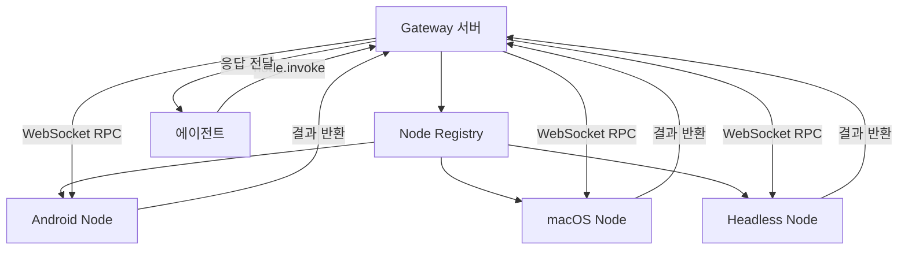
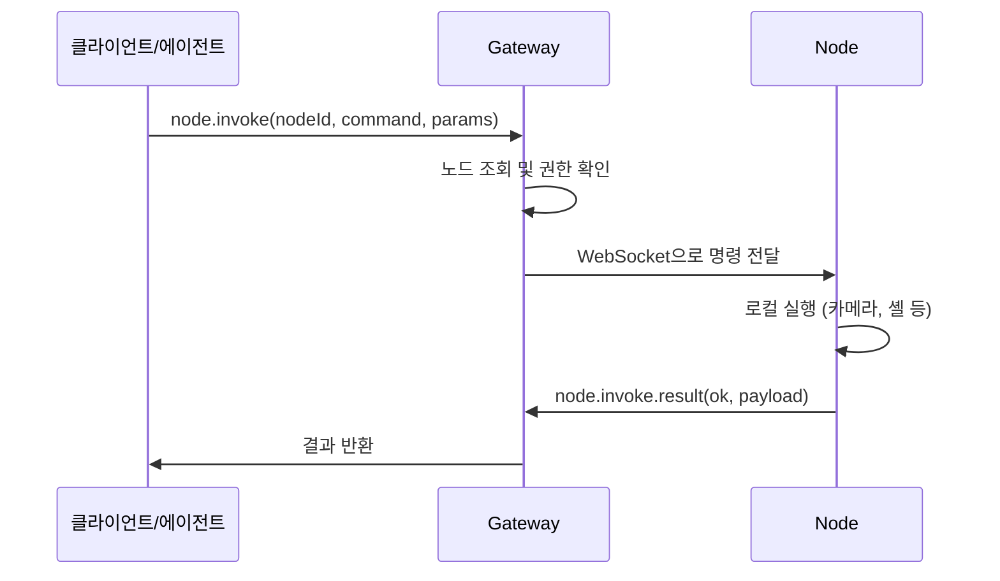

## Node란 무엇인가

Node는 Gateway에 연결되어 플랫폼별 기능을 제공하는 컴패니언 장치입니다.
스마트폰의 카메라, 데스크톱의 셸 실행, 화면 녹화 등의 기능을
에이전트가 원격으로 사용할 수 있게 해줍니다.

Gateway가 중앙 두뇌라면, Node는 팔과 다리에 해당합니다.

## 노드 유형

| 유형          | 플랫폼                | 주요 기능                                |
| ------------- | --------------------- | ---------------------------------------- |
| Mobile Node   | Android, iOS          | 카메라, GPS, SMS, 캔버스, 음성           |
| macOS Node    | macOS                 | 셸 실행, 카메라, 캔버스, 화면 녹화, 알림 |
| Headless Node | Linux, Windows, macOS | 셸 실행 (서버/원격 머신용)               |

## 전체 아키텍처



## Node Registry

`src/gateway/node-registry.ts`(209줄)에서 연결된 노드를 관리합니다.

### NodeSession 구조

```typescript
interface NodeSession {
  nodeId: string; // 고유 노드 식별자
  connId: string; // WebSocket 연결 ID
  displayName?: string; // 사용자 지정 이름
  platform?: string; // "iOS", "Android", "macOS", "Linux"
  version?: string; // 앱 버전
  deviceFamily?: string; // "iPhone", "iPad", "Mac" 등
  caps: string[]; // 지원 능력 목록
  commands: string[]; // 실행 가능한 RPC 명령어
  permissions?: Record<string, boolean>; // OS 권한 상태
  connectedAtMs: number; // 연결 시각
}
```

### 주요 메서드

| 메서드            | 설명                  |
| ----------------- | --------------------- |
| `register()`      | 새 노드 등록          |
| `unregister()`    | 노드 연결 해제        |
| `listConnected()` | 현재 연결된 노드 목록 |
| `invoke()`        | 노드에 명령 전송      |

## 페어링 시스템

노드가 Gateway에 처음 연결할 때 페어링 과정을 거칩니다.
`src/infra/node-pairing.ts`(336줄)에 구현되어 있습니다.

<Steps>
  <Step title="페어링 요청">
    노드가 `node.pair.request`를 보냅니다. Gateway는 요청을 대기열에 넣고 관리자에게 알립니다.
    요청은 5분 후 만료됩니다.
  </Step>
  <Step title="승인">
    관리자가 `node.pair.approve`로 승인합니다. Gateway가 영구 토큰을 발급합니다.
  </Step>
  <Step title="토큰 저장">
    노드는 토큰을 로컬에 저장합니다. 이후 재연결 시 토큰으로 자동 인증됩니다.
  </Step>
</Steps>

페어링 상태는 파일 시스템에 저장됩니다.

```
~/.openclaw/nodes/
  pending.json    # 대기 중인 페어링 요청
  paired.json     # 승인된 노드 목록과 토큰
```

<Info>페어링은 한 번만 하면 됩니다. 승인된 노드는 재시작 후에도 토큰으로 자동 연결됩니다.</Info>

## 능력 광고 (Capability Advertisement)

노드는 연결 시 자신이 지원하는 기능을 Gateway에 알립니다.

### 지원 능력 목록

| 능력        | 설명                   | 지원 플랫폼     |
| ----------- | ---------------------- | --------------- |
| `canvas`    | WebView 기반 UI 렌더링 | Android, macOS  |
| `camera`    | 사진/동영상 촬영       | Android, macOS  |
| `screen`    | 화면 녹화              | Android, macOS  |
| `location`  | GPS 위치               | Android, macOS  |
| `sms`       | 문자 메시지 전송       | Android         |
| `talk`      | 음성 합성              | Android         |
| `voiceWake` | 음성 깨우기 감지       | Android         |
| `system`    | 셸 명령 실행           | macOS, Headless |

에이전트는 `node.list`를 호출하여 사용 가능한 노드와 능력을 확인한 후,
적절한 노드에 명령을 보냅니다.

## RPC 프로토콜

`src/gateway/protocol/schema/nodes.ts`(102줄)에 프로토콜이 정의되어 있습니다.
Typebox 스키마로 유효성을 검증합니다.

### 핵심 RPC 메서드

<Tabs>
<Tab title="페어링">

```
node.pair.request    # 페어링 요청
node.pair.approve    # 페어링 승인
node.pair.reject     # 페어링 거부
node.pair.list       # 페어링 목록 조회
```

</Tab>
<Tab title="명령 실행">

```
node.invoke          # 노드에 명령 전송
node.invoke.result   # 명령 실행 결과 반환
```

호출 파라미터:

```typescript
{
  nodeId: string;         // 대상 노드 ID
  command: string;        // 예: "camera.snap"
  params?: unknown;       // 명령별 파라미터
  timeoutMs?: number;     // 타임아웃 (밀리초)
  idempotencyKey: string; // 중복 실행 방지 키
}
```

</Tab>
<Tab title="관리">

```
node.list            # 연결된 노드 목록
node.describe        # 노드 상세 정보
node.rename          # 노드 이름 변경
node.event           # 노드 이벤트 전송
```

</Tab>
</Tabs>

### 호출 흐름



타임아웃이 발생하거나 노드가 연결 해제되면 Gateway가 자동으로 에러를 반환합니다.

## 이벤트 시스템

노드는 명령 응답 외에도 자발적으로 이벤트를 보낼 수 있습니다.
`src/gateway/server-node-events.ts`에 구현되어 있습니다.

| 이벤트             | 설명                   |
| ------------------ | ---------------------- |
| `voice.transcript` | 음성 인식 결과         |
| `agent.request`    | 에이전트에게 직접 요청 |

노드의 음성 입력은 채팅 세션에 자동 라우팅되어 에이전트가 처리합니다.

## 명령 정책

`src/gateway/node-command-policy.ts`에서 노드별 명령 실행 권한을 관리합니다.
노드의 능력과 OS 권한 상태를 기반으로 명령 허용 여부를 결정합니다.

## CLI로 노드 관리

```bash
# 연결된 노드 목록
openclaw nodes list

# 노드 상세 정보
openclaw nodes describe --node <id>

# 노드에 명령 실행
openclaw nodes invoke --node <id> --command <cmd> --params <json>

# 카메라 촬영
openclaw nodes camera snap --node <id>

# 화면 녹화
openclaw nodes screen record --node <id>

# GPS 위치
openclaw nodes location get --node <id>

# 셸 명령 (Headless/macOS)
openclaw nodes run --node <id> -- ls -la
```

## 소스 구조 요약

```
src/
  gateway/
    node-registry.ts            # 노드 등록/관리 (209줄)
    node-command-policy.ts      # 명령 권한 정책
    server-node-events.ts       # 이벤트 라우팅
    server-node-subscriptions.ts # 구독 관리
    server-mobile-nodes.ts      # 모바일 노드 감지
    server-methods/nodes.ts     # RPC 핸들러
    protocol/schema/nodes.ts    # 프로토콜 스키마 (102줄)
  infra/
    node-pairing.ts             # 페어링 (336줄)
  node-host/
    runner.ts                   # Headless 노드 (1,288줄)
  cli/
    nodes-cli.ts                # CLI 디스패처
```

## 관련 문서

<CardGroup cols={2}>
  <Card title="Android Node" icon="mobile" href="/android-node">
    Android 앱의 노드 구현을 설명합니다.
  </Card>
  <Card title="macOS Node" icon="desktop" href="/macos-node">
    macOS 앱의 노드 구현을 설명합니다.
  </Card>
</CardGroup>
