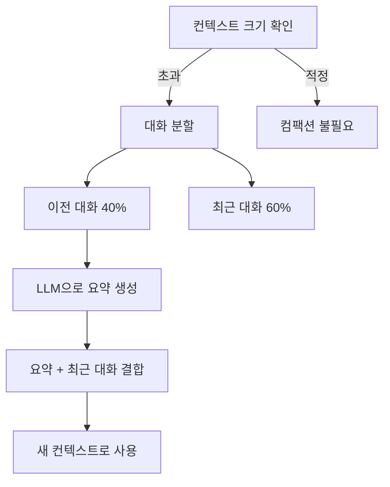

## 세션이란 무엇인가

세션은 사용자와 에이전트 간의 대화 단위입니다.
각 세션은 고유한 세션 키로 식별되며, 대화 히스토리(트랜스크립트)를 저장합니다.

`src/config/sessions/`에 2,600줄의 코드로 구현되어 있습니다.

## 세션 키 구조

세션 키는 대화를 고유하게 식별하는 문자열입니다.

```
{channel}:{accountId}:{targetId}
```

| 요소        | 설명         | 예시                           |
| ----------- | ------------ | ------------------------------ |
| `channel`   | 메시징 채널  | `telegram`, `discord`, `slack` |
| `accountId` | 채널 계정 ID | 봇 토큰의 고유 식별자          |
| `targetId`  | 대화 대상 ID | 채팅방 ID, DM 상대 ID          |

```
// 예시: Telegram 그룹 채팅 세션
telegram:bot123456:group-789012

// 예시: Discord DM 세션
discord:bot-abc:user-456
```

같은 채널과 계정이라도 대화 대상이 다르면 별도 세션으로 관리됩니다.

## 데이터 저장 구조

### SQLite 세션 인덱스

세션 메타데이터는 SQLite에 저장됩니다. `SessionEntry` 타입으로 관리합니다.

```typescript
interface SessionEntry {
  sessionKey: string; // 고유 세션 키
  agentId: string; // 담당 에이전트 ID
  lastMessageAt: number; // 마지막 메시지 시각
  messageCount: number; // 총 메시지 수
  metadata?: Record<string, unknown>;
}
```

### JSONL 트랜스크립트

실제 대화 내용은 JSONL(JSON Lines) 파일로 저장됩니다.

```
~/.openclaw/sessions/{agentId}/{sessionKey}.jsonl
```

각 줄이 하나의 메시지를 나타내며, 순서대로 추가됩니다.

```json
{"role":"user","content":"안녕하세요","timestamp":1707900000}
{"role":"assistant","content":"안녕하세요! 무엇을 도와드릴까요?","timestamp":1707900001}
{"role":"user","content":"날씨 알려줘","timestamp":1707900010}
```

<Info>
  JSONL 형식은 대화가 길어져도 전체 파일을 파싱하지 않고 끝에 추가만 하면 되므로 효율적입니다.
</Info>

## 세션 캐시

빈번한 디스크 접근을 줄이기 위해 메모리 캐시를 사용합니다.

```
캐시 TTL: 45초
```

세션 데이터를 처음 로드하면 45초 동안 메모리에 캐시합니다.
같은 세션에 대한 후속 요청은 디스크 접근 없이 캐시에서 바로 반환됩니다.

45초가 지나면 캐시가 만료되어 다음 접근 시 디스크에서 다시 로드합니다.

## 컴팩션 (대화 압축)

대화가 길어지면 LLM의 컨텍스트 윈도우를 초과할 수 있습니다.
컴팩션은 이전 대화를 요약하여 컨텍스트 크기를 줄이는 메커니즘입니다.

`src/agents/compaction.ts`에 구현되어 있습니다.

### 컴팩션 동작 방식



### 청크 비율

```
BASE_CHUNK_RATIO = 0.4
```

컨텍스트 윈도우가 가득 차면, 대화의 앞쪽 40%를 요약 대상으로 선택합니다.
나머지 60%는 원본 그대로 유지됩니다.

<Warning>
  컴팩션 시 요약 과정에서 세부 정보가 손실될 수 있습니다. 중요한 정보는 메모리 시스템에 별도
  저장하는 것을 권장합니다.
</Warning>

### 적응형 컴팩션

단순히 고정 비율로 자르지 않고, 대화의 맥락을 고려합니다.

| 상황               | 동작                          |
| ------------------ | ----------------------------- |
| 도구 호출 중간     | 도구 호출과 결과를 함께 유지  |
| 연속된 짧은 메시지 | 함께 묶어서 요약              |
| 시스템 프롬프트    | 항상 유지, 요약 대상에서 제외 |

## 세션 관리 도구

에이전트는 `sessions-list-tool.ts`를 통해 세션을 관리할 수 있습니다.

| 기능           | 설명                                       |
| -------------- | ------------------------------------------ |
| 세션 목록 조회 | 현재 에이전트의 모든 세션 목록             |
| 세션 정보 확인 | 특정 세션의 메시지 수, 마지막 활동 시각 등 |
| 세션 삭제      | 더 이상 필요 없는 세션 정리                |

## 컨텍스트 윈도우 가드

`context-window-guard.ts`가 컨텍스트 윈도우 사용량을 실시간으로 모니터링합니다.

<Steps>
  <Step title="토큰 카운트">현재 대화의 토큰 수를 계산합니다.</Step>
  <Step title="임계값 확인">설정된 임계값(보통 80%)을 초과하는지 확인합니다.</Step>
  <Step title="컴팩션 트리거">임계값을 초과하면 자동으로 컴팩션을 실행합니다.</Step>
  <Step title="경고 로깅">컴팩션이 발생하면 로그에 기록하여 추적 가능하게 합니다.</Step>
</Steps>

## 관련 문서

<CardGroup cols={2}>
  <Card title="메모리 시스템" icon="brain" href="/memory">
    장기 기억 저장소와 하이브리드 검색을 다룹니다.
  </Card>
  <Card title="Agent 시스템" icon="robot" href="/agents">
    세션을 활용하는 에이전트 실행 루프를 설명합니다.
  </Card>
</CardGroup>
